# SafetyMonitor — Complete Solution Documentation

## 1. Solution Purpose

`SafetyMonitor` is a multi-project ecosystem for end-to-end observatory weather/safety telemetry workflows:

- data acquisition from **ASCOM Alpaca** devices (`DataCollector`),
- durable Firebird-based storage and aggregations (`DataStorage`),
- synthetic data generation for demos/tests (`DataGenerator`),
- historical aggregation rebuilds (`DataAggregator`),
- rich desktop dashboard visualization (`SafetyMonitor`),
- unified build version management (`build/VersioningTool`).

Projects in the solution:

- `SafetyMonitor` (WinForms UI)
- `DataCollector` (CLI collector from devices)
- `DataGenerator` (CLI synthetic data generator)
- `DataAggregator` (CLI aggregation recalculation)
- `DataStorage` (storage/query/validation library)
- `build/VersioningTool` (shared version generator)

---

## 2. Data Flow Architecture

1. `DataCollector` connects to `ObservingConditions` + `SafetyMonitor` and acquires samples.
2. `DataStorage` persists raw samples into `*_RAW.fdb` shards and aggregated buckets into `*_AGG.fdb` shards.
3. `SafetyMonitor` consumes stored data:
   - Value Tiles: latest sample in lookback window,
   - Chart Tiles: raw or aggregated time series.
4. `DataGenerator` can pre-fill storage with synthetic data.
5. `DataAggregator` can rebuild aggregates for any historical range.

---

## 3. UI Screenshots (from `images/`)

### Main views

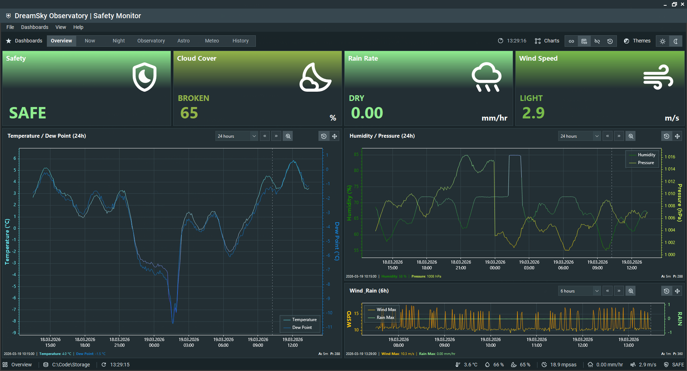
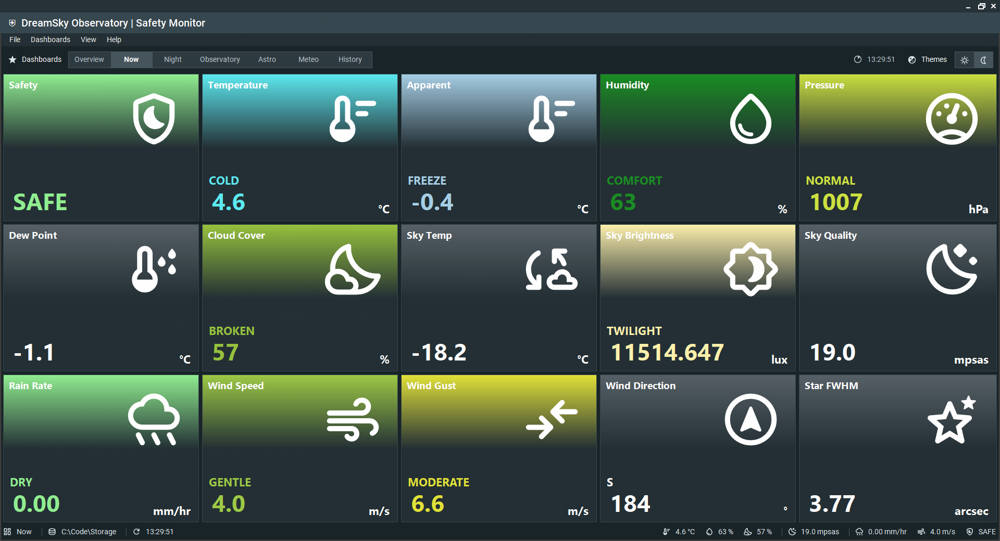
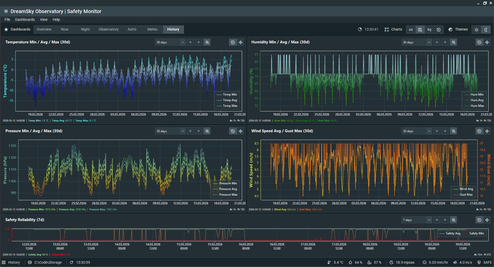

### Themes

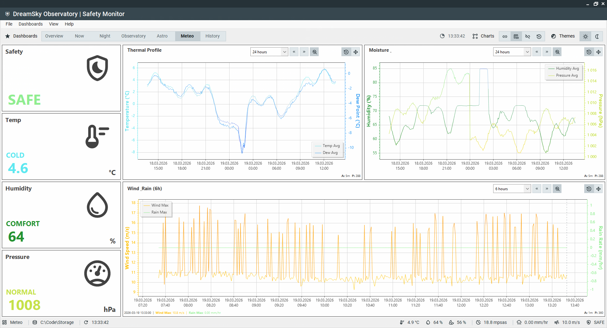
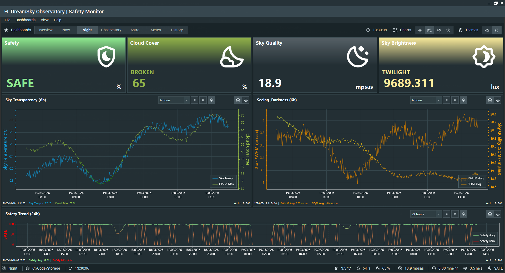

### Configuration and editors

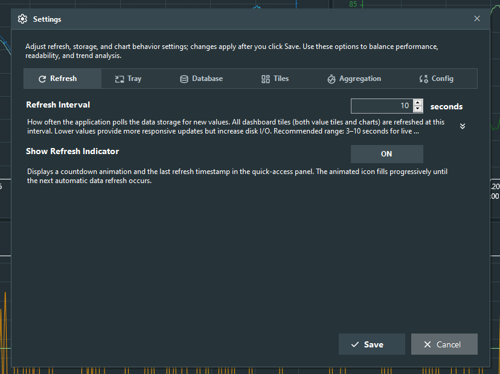
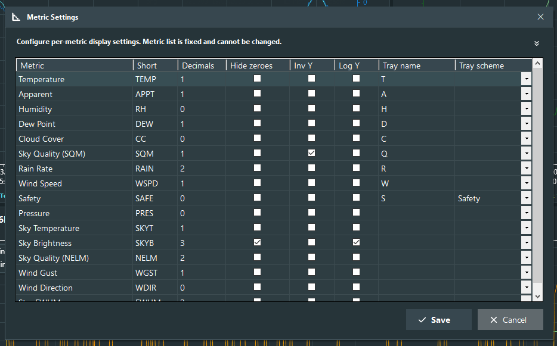
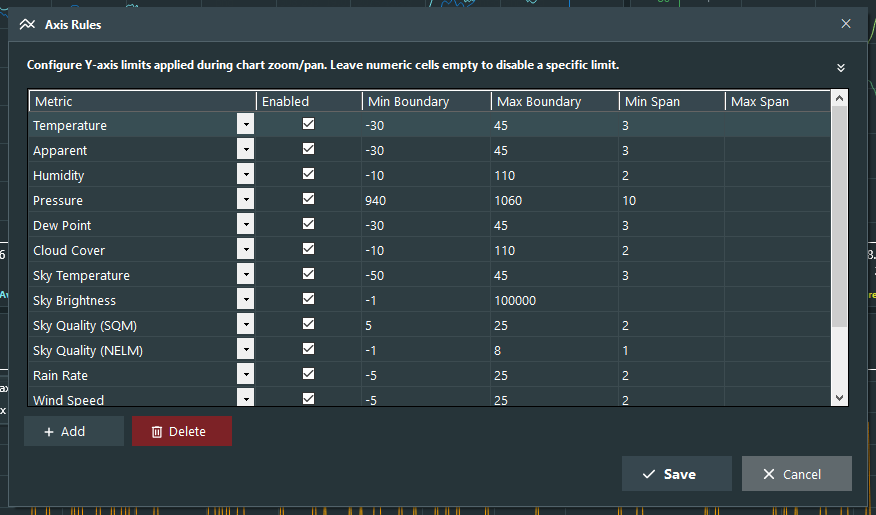
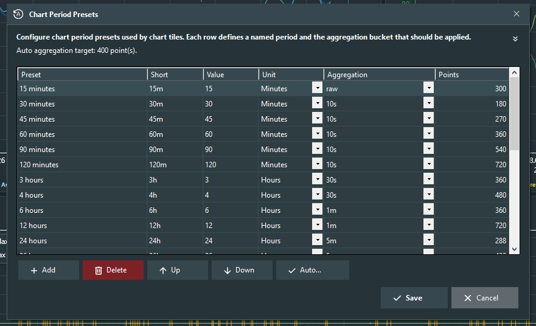
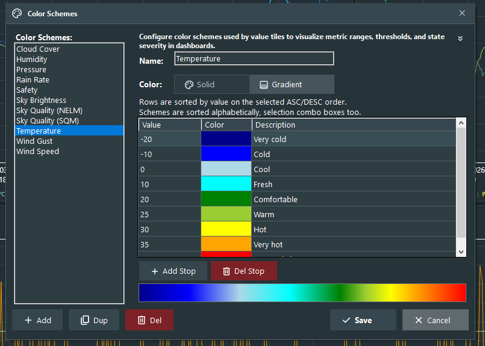
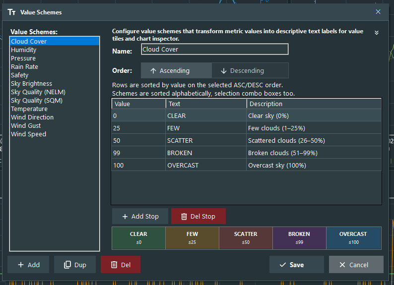

### Tile types

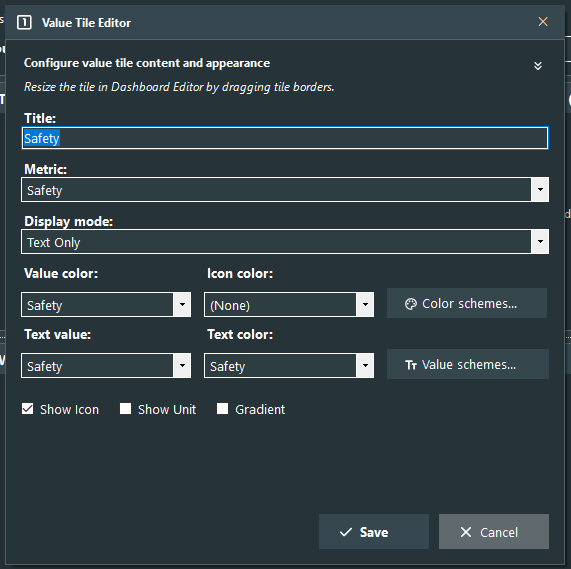
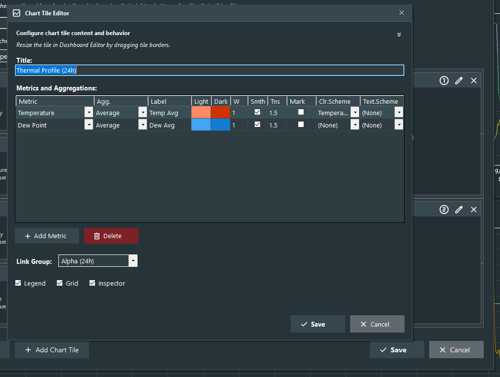

### Additional dashboard examples

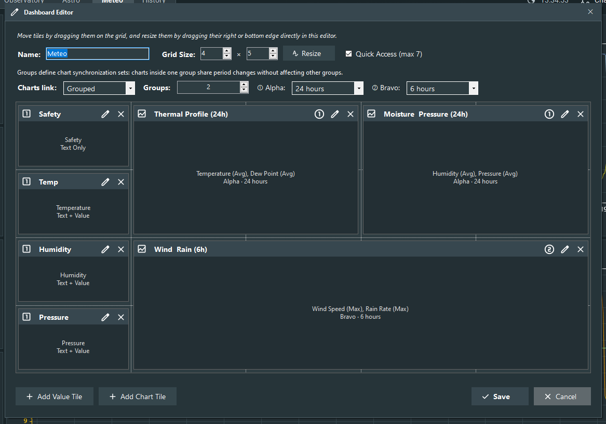
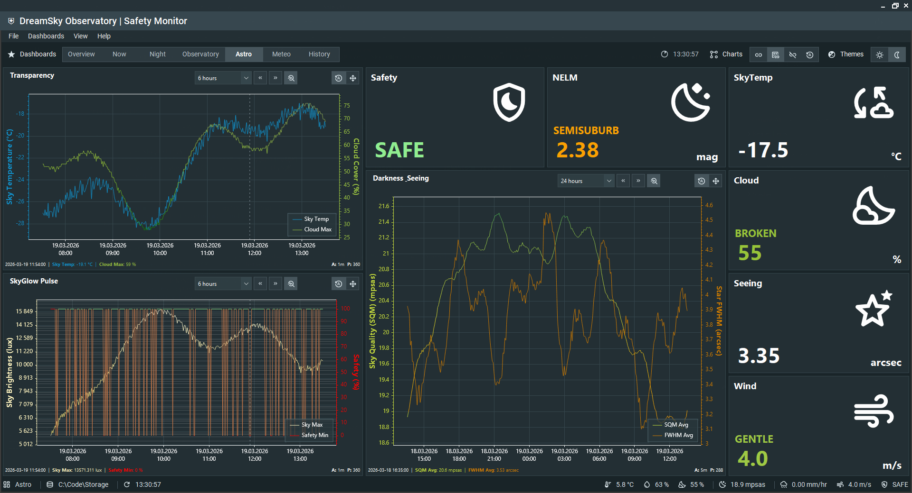

---

## 4. Repository Documentation Map

- `SafetyMonitor/README.md` — full UI app behavior and workflows
- `DataCollector/README.md` — complete CLI key reference and runtime behavior
- `DataGenerator/README.md` — synthetic data generation workflow
- `DataAggregator/README.md` — aggregation recalculation workflow
- `DataStorage/README.md` — storage design, API, and schema model
- `build/VersioningTool/README.md` — shared versioning engine

---

## 5. Quick Start (minimum scenario)

1. Prepare a storage folder (example: `D:\MeteoStorage`).
2. Seed data:

```bash
dotnet run --project DataGenerator -- --storage-path "D:\MeteoStorage" --start 2026-03-01T00:00:00 --count 5000 --interval 60
```

3. Launch UI:

```bash
dotnet run --project SafetyMonitor
```

4. In **Settings**, set the same storage path.

---

## 6. Build

Build entire solution:

```bash
dotnet build SafetyMonitor.slnx
```

You can run any CLI project via `dotnet run --project <ProjectName> -- <args>`.

---

## 7. Deep Dive Docs

Each project folder contains a dedicated, detailed README.
